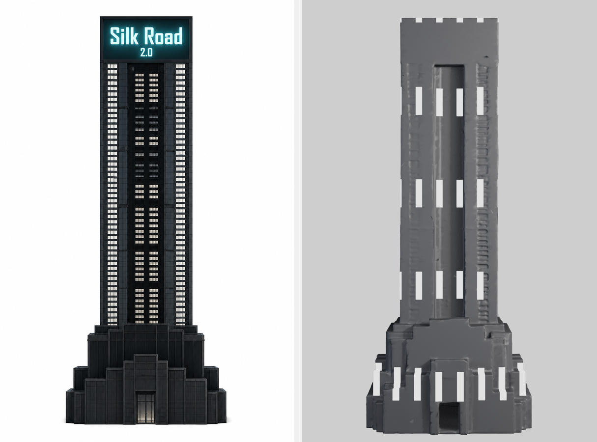

# The asset does not have the facade it is being judged on

Measured 2026-08-15 by `docs/probes/spike_lookdev.py` and `pipeline/facade.py`. This is
the first thing a lookdev turntable was pointed at, and it failed the asset immediately —
which is the point of having one.

## The gap



Left, the design plate `assets/sr2_tower/isolated/view_0.png`: hundreds of small window
cells in four vertical strips, a near-black body, ribbed piers, a stepped Art-Deco podium,
and a dark sign panel with glowing letters.

Right, a front-on turntable of the mesh the pipeline actually builds with: a grey body,
about two dozen oversized white slabs painted on by `bvfx_emissive_windows`, and no sign.

Meshy produced a **massing model**. The relief is real — piers, the central recess,
setbacks, stepped podium, 260,332 polygons — but the plate's window detail is not in the
geometry and not in a texture. It did not survive image→3D.

| | plate | mesh (front-on) |
|---|---|---|
| facade profile L1 | — | **0.242** |
| outer/core ratio | **3.37** | **1.91** |
| body level | 36.8 | 66.1 |
| window level | 246.6 | 206.8 |

## Why the existing gate passed it

Ticket #30 added `compare_to_plate` at normalise time, and it works as designed:
sr2_tower measures 1.73x base flare against the plate's 1.85x.

**A silhouette statistic cannot see a facade.** The check compares outlines. The asset it
passed has no windows, no sign, and a facade profile nowhere near the plate's.

This is the same defect as #37 — a band statistic standing in for a subject-shaped
requirement — in a different place. Stated as a rule:

> A gate must measure the property the artifact is *for*. An asset is for its look, not
> its outline.

Which matters, because `WHEN_TO_GENERATE.md` holds this exact check up as the pipeline's
one working example of "generate, then gate on a measurement", and the thing to
generalise. It gates on the wrong quantity.

## What this means for layer 2

Five attempts, $78.76, never cleared all four frames. The layer was asked to make the
tower "read like the reference" using:

- an asset whose facade **does not exist**, and
- `bvfx_emissive_windows`, a uniform-grid helper that cannot express strips-plus-dark-core
  at any parameter setting.

Both were unstated assumptions that nobody had checked. Combined with the lighting trap
(`LIGHTING_FINDING.md`) — where a sun renders black and emission is the only tool that
puts pixels on screen — the layer was being asked to do something the pipeline could not
do, and marked down four frames a run for failing.

## The instrument

`pipeline/facade.py` collapses a tower shaft to a horizontal luminance profile: for each
pixel column, the mean down the shaft. Windows are vertical runs, so a lit strip becomes a
peak and a recessed core a trough. Normalising x by shaft width and luminance by the
shaft's own range makes a 321px plate and a 241px render directly comparable.

```
PLATE                                    outer/core 3.37
  0.85 |     #                           #
  0.60 |   ####                          ####
  0.35 |#  #####        ###   ###        ####  #
  0.15 |############   ####  ####   ############
```

That ASCII is the thing the critic has been describing in prose for five attempts — "two
bright OUTER window strips against a darker recessed core" — as a number.

It deliberately does **not** locate a tower in a cluttered frame. Segmenting a dark tower
from a dark city at night is what defeated four earlier hand-rolled detectors in this
project; callers pass a box, or use a render whose background separates.

## Three bugs found while building it

**1. `rotation_euler` is a silent no-op on imported assets.** glTF import leaves objects
in `QUATERNION` rotation mode, where Blender ignores `rotation_euler` entirely — no error.
The turntable produced four "angles" that were identical to the pixel. `bvfx_aim()` would
fail the same way on an imported object. Fixed at the source in `_bvfx_import_asset` and
`_bvfx_aim`.

**2. Segmentation on a magic constant.** `facade_profile` treated "background" as ≥240;
the turntable backdrop resolved to 211 after the view transform, so the entire frame
counted as subject and every angle returned an identical profile of the *backdrop*. Now
segmented against the measured corner value, and a shaft spanning >97% of the frame
returns an explicit `warning` rather than a confident number.

**3. Framing from an assumed origin.** The first rig set the asset to `(0,0,0)` and aimed
at `z = height/2`, assuming the base sat at z=0. It does not — import leaves the centre
near the origin — so the camera framed the top third and every measurement was of empty
backdrop.

All three produced *plausible numbers*. None raised an error. That is the recurring shape
of failure in this project, and the reason the fix for each was a loud failure mode rather
than a corrected constant.
